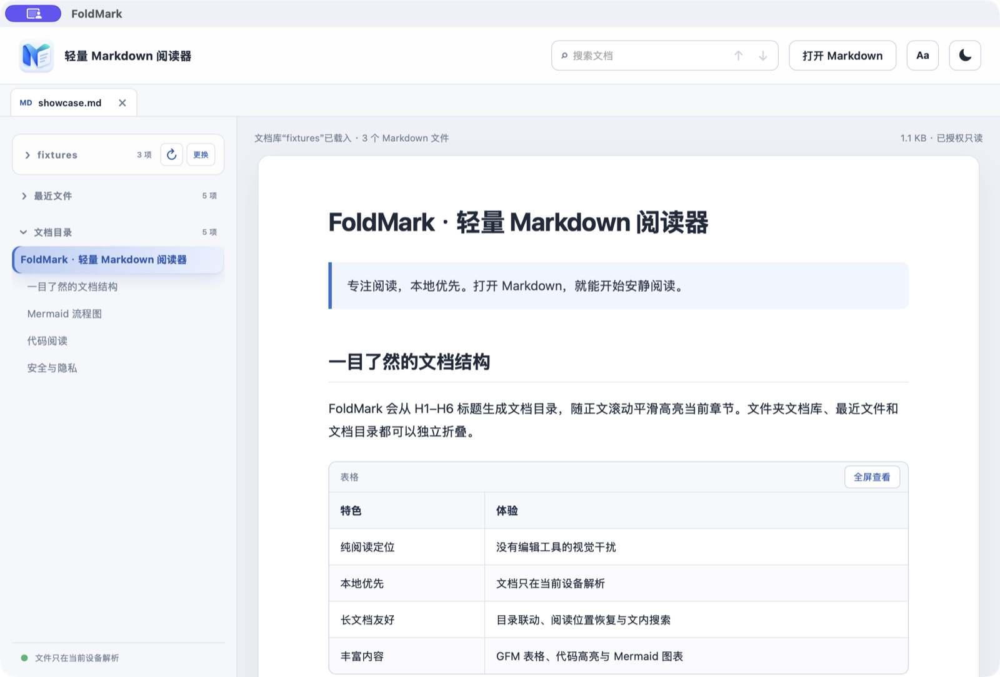
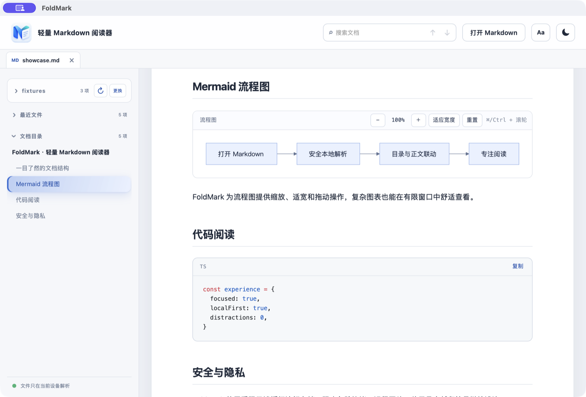

<p align="center">
  
</p>

<h1 align="center">FoldMark</h1>

<p align="center"><strong>轻量、专注、本地优先的 Markdown 阅读器</strong></p>

<p align="center">
  
  
  
</p>

<p align="center">
  <a href="https://github.com/Yanzy009/FoldMark/releases/download/v0.1.5/FoldMark_0.1.5_universal.dmg"></a>
  <a href="https://github.com/Yanzy009/FoldMark/releases/download/v0.1.5/FoldMark_0.1.5_x64-setup.exe"></a>
</p>

<p align="center">
  <a href="https://github.com/Yanzy009/FoldMark/releases/latest">查看最新版本与全部下载</a>
</p>

FoldMark 面向“打开后安静阅读”这一件事：极简的方式，把表格、代码、Mermaid 流程图与长文档目录做成适合持续阅读的桌面体验。

## 下载与安装

| 系统 | 安装包 | 适用设备 |
| --- | --- | --- |
| macOS | [`FoldMark_0.1.5_universal.dmg`](https://github.com/Yanzy009/FoldMark/releases/download/v0.1.5/FoldMark_0.1.5_universal.dmg) | Apple Silicon 与 Intel Mac |
| Windows | [`FoldMark_0.1.5_x64-setup.exe`](https://github.com/Yanzy009/FoldMark/releases/download/v0.1.5/FoldMark_0.1.5_x64-setup.exe) | 64 位 Windows 10 / 11 |

> 请下载 `.dmg` 或 `.exe` 安装包。GitHub 页面中的 `Source code (zip)` 和 `Source code (tar.gz)` 是供开发者使用的源码，不是可直接安装的软件。

当前安装包尚未进行商业代码签名。macOS 首次打开如被 Gatekeeper 拦截，请在 Finder 中右键 FoldMark 并选择“打开”；Windows 如出现 SmartScreen 提示，请确认下载来源是本 GitHub 仓库后选择“更多信息 → 仍要运行”。

## 界面预览



<p align="center"><sub>可折叠文档库 · 目录跟随高亮 · GFM 表格</sub></p>



<p align="center"><sub>Mermaid 缩放与适宽 · 代码高亮 · 平滑章节导航</sub></p>

## 为什么是 FoldMark

- **纯阅读**：没有编辑器、打印和导出工具带来的视觉干扰；
- **本地优先**：文档只在当前设备解析，不上传内容；
- **长文档友好**：目录联动、平滑高亮、阅读位置恢复和文内搜索；
- **复杂内容友好**：表格可全屏，Mermaid 可缩放拖动，代码可高亮复制。

## 功能

- CommonMark、GFM 表格、任务列表、删除线与安全链接；
- Mermaid 流程图缩放、适宽、拖动与大文件延迟渲染；
- 代码高亮与复制，表格独立滚动和全屏阅读；
- H1–H6 自动目录、正文联动与平滑气泡高亮；
- 多标签、文内搜索、阅读位置恢复、深浅主题和阅读偏好；
- 可独立折叠的文件夹文档库、最近文档与文档目录；
- 文档库一键重新扫描，以及 Finder/资源管理器拖放；
- macOS / Windows 文件关联、双击打开和单实例文件转交；
- UTF-8、UTF-8 BOM、GBK/GB18030 中文文档；
- 同目录本地图片与 Markdown 链接的受限只读访问。

## 安全与隐私

文档只在当前设备解析。桌面端通过 Rust 命令和短期会话令牌访问用户明确打开的文件，不向网页渲染层暴露任意文件系统权限；原始 HTML 不执行，危险协议、远程图片、父目录穿越和符号链接逃逸会被阻止。

## 开发

需要 Node.js 22、Rust stable 和当前平台的 Tauri 2 系统依赖。

```bash
npm ci
npm run desktop:dev
```

完整检查：

```bash
npm run check
cargo test --manifest-path src-tauri/Cargo.toml
cargo clippy --manifest-path src-tauri/Cargo.toml --all-targets -- -D warnings
npm audit --omit=dev
```

`fixtures/` 中保留可公开的人工回归与界面演示文档，用于安全降级、外部保存自动刷新和主要阅读能力检查。

本机构建安装包：

```bash
npm run desktop:build
```

推送 `v*` 标签后，仓库中的 GitHub Actions 会同时生成支持 Apple Silicon 与 Intel 的 macOS Universal DMG，以及 Windows x64 NSIS 安装包。当前安装包未进行商业代码签名，首次打开时 macOS Gatekeeper 或 Windows SmartScreen 可能要求用户手动确认。

## 发布状态

当前公开版本为 `0.1.5`。macOS 与 Windows 安装包均由 GitHub Actions 在官方托管环境中从同一版本标签自动构建，并自动创建正式公开的 Release。安装与实机验收方法详见 [RELEASE_CHECKLIST.md](RELEASE_CHECKLIST.md) 与 [WINDOWS_TEST.md](WINDOWS_TEST.md)。

## 项目边界

FoldMark 是纯阅读器。打印、PDF、自包含 HTML 导出和 Markdown 编辑不在当前路线中。

## License

MIT
