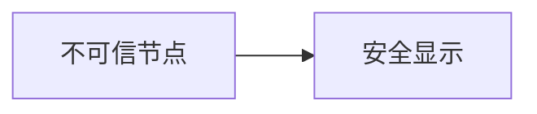

# 安全回归样例

原始 HTML 不应执行：

[危险链接](javascript:alert('blocked'))

## Mermaid 链接清理

```mermaid
flowchart LR
    A[不可信节点] --> B[安全显示]
    click A "javascript:alert('blocked')" "危险链接"
```

## Mermaid 错误降级

```mermaid
flowchart TD
    A[缺失闭合
```
